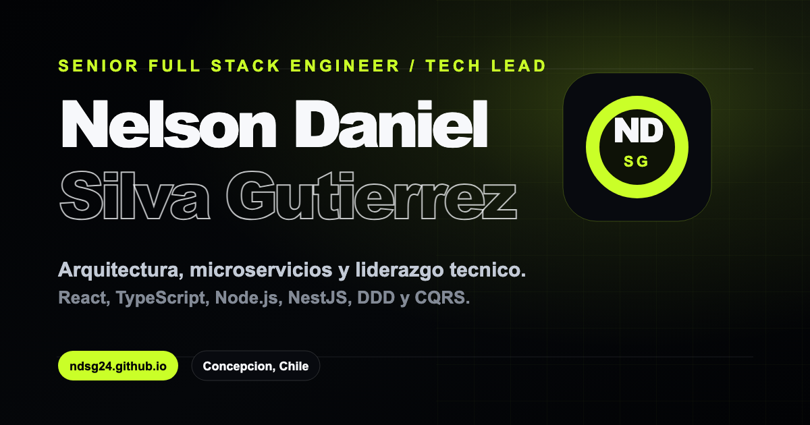

<div align="center">

<a href="https://ndsg24.github.io/portfolio/"></a>

# Portafolio · Nelson Daniel Silva Gutiérrez

Portafolio personal multilenguaje, rápido y accesible, con tema claro/oscuro y deploy continuo.

[](https://ndsg24.github.io/portfolio/)
[](https://github.com/ndsg24/portfolio/actions/workflows/pages.yml)


</div>

---

## ✨ Características

- 🌎 **Multilenguaje (ES · EN · PT)** con i18next; el idioma se refleja en la URL y en los metadatos SEO.
- 🌗 **Tema claro y oscuro** persistente, que también actualiza el favicon y el `theme-color`.
- 🎞️ **Animaciones** con Framer Motion, con soporte para movimiento reducido.
- 🔎 **SEO completo:** Open Graph, `sitemap.xml`, `robots.txt` y web manifest.
- ⚡ **Rendimiento:** imágenes responsive en WebP y fuente local optimizada.
- 🚀 **Deploy continuo** a GitHub Pages con GitHub Actions en cada push a `main`.

## 🧱 Stack

| Área | Tecnologías |
|---|---|
| UI | React, TypeScript, CSS por feature |
| Build | Vite |
| i18n | i18next, react-i18next |
| Animación | Framer Motion |
| Íconos | Lucide, Simple Icons |
| Calidad | ESLint, typescript-eslint, `tsc --noEmit` |
| CI/CD | GitHub Actions → GitHub Pages |

## 🗂️ Estructura

Organizado **por features**, separando composición, dominio y piezas compartidas:

```text
src/
├── app/          # Composición raíz, providers (tema, idioma, contenido) y hooks globales
├── features/     # Secciones autocontenidas: hero, experience, stack, principles, contact, navigation
├── i18n/         # Configuración, idiomas, traducciones y metadatos SEO por idioma
└── shared/       # Componentes, utilidades, motion y estilos reutilizables
```

## 🚀 Desarrollo local

```bash
npm install
npm run dev        # servidor de desarrollo
npm run lint       # ESLint
npm run typecheck  # verificación de tipos
npm run build      # build de producción
npm run preview    # previsualizar el build
```

## 📬 Contacto

[](https://www.linkedin.com/in/nelson-daniel-dev/)
[](https://github.com/ndsg24)
